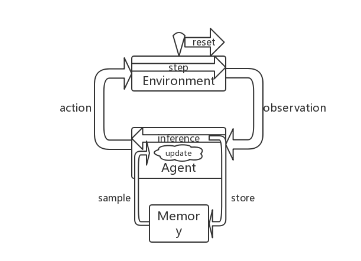

# RL-Algo
工作流程文档：[链接](https://docs.google.com/document/d/1JHuQaDlghXzIX-O2iSxKlCoToozOPBYTZrWt8PbxY98/edit?usp=sharing)

<!-- TOC depthFrom:1 depthTo:6 withLinks:1 updateOnSave:1 orderedList:0 -->
- [RL-Algo](#rl-algo)
	- [特点](#特点)
	- [实验结果](#实验结果)
	- [安装](#安装)
	- [使用示例](#使用示例)
	- [引用](#引用)
	- [交互框架](#交互框架)
		- [环境和Agent](#环境和agent)
	- [算法涵盖](#算法涵盖)
		- [代码组成](#代码组成)
	- [代码主要部分](#代码主要部分)
	- [Estimator主要部分](#estimator主要部分)
	- [信息传递流程图](#信息传递流程图)
<!-- /TOC -->


## 特点
- 一个Agent和多个Environment进行交互，加快探索。
- 方便重现结果

## 算法涵盖
- DQN
- DoubleDQN
- DuelDQN
- DistDQN
- A2C
- TRPO
- PPO
- DiscretePPO
- DDPG


## 实验结果
- Breakout
- Seaquest
- SpaceInvaders
- Mujoco系列

DoubleDQN的结果，Rainbow的结果和我们的结果。

|    	   		 | DoubledQN |Rainbow | RLPack |
|---------------|-----------|--------|---------|
| Breakout 		 |	         |        |        |
| Seaquest 		 |           |        |    	   |
| SpaceInvaders |           |        |		   |
| Mujoco        |           |        |  	   |	 


## 安装
依赖：

- gym
- tensorflow-gpu=1.8

依赖项可通过pip安装。
注意，`gym.mujoco`的使用需要额外的许可，请参考[gym](https://github.com/openai/gym)。
`tensorflow`有cpu版本和gpu版本，根据配置选择。

```bash
$ pip install "gym[atari,mujoco]"
$ pip install tensorflow
$ pip install tensorflow-gpu==1.8.0
```

安装依赖后，使用下属方式安装在本地。建议使用Anaconda环境。

```bash
$ git clone https://github.com/smsxgz/rl-algo.git
$ cd rl-algo
$ pip install -e .
```

## 使用示例

```bash
$ python examples/run_ppo_contppo_reacher.py
```


额外的参数
- `result_path`：模型和结果存储路径。
- `batch_size`：batch size。
- `memory_size`：存储中间操作的大小。
- `lr`：学习率。
- `n_env`：从多个env处拿到Obervation。
- `n_action`：actiond的数目（离散动作）。
- `dim_action`：action维数（连续动作）。
- `dim_ob`：observation的维数。
- `discount`：discount。
- `n_step`：每次和环境交互的步数。
- `save_model_every`：多久保存一次模型。
- `update_target_every`：多久更新一次target模型。


## 参考

- [Human-level control through deep reinforcement learning](https://www.nature.com/articles/nature14236)
- [Deep Reinforcement Learning with Double Q-learning](https://arxiv.org/abs/1509.06461)
- [Averaged-DQN: Variance Reduction and Stabilization for Deep Reinforcement Learning](https://arxiv.org/pdf/1611.01929)
- [A Distributional Perspective on Reinforcement Learning](https://arxiv.org/abs/1707.06887)
- [Reinforcement Learning with Deep Energy-Based Policies](https://arxiv.org/abs/1702.08165)
- [Trust Region Policy Optimization](https://arxiv.org/abs/1502.05477)
- [Proximal Policy Optimization Algorithms](https://arxiv.org/abs/1707.06347)
- [Asynchronous Methods for Deep Reinforcement Learning](https://arxiv.org/abs/1602.01783)
- [Continuous control with deep reinforcement learning](https://arxiv.org/abs/1509.02971)
- [Introduction to Reinforcement Learning](https://dl.acm.org/citation.cfm?id=551283)


## 交互框架
### 环境和Agent
一个玩家同时和多个环境进行交互，从多个环境处收集数据进行训练。


## 代码组成
### 代码主要部分
- algos：构建算法，包括搭建网络，更新策略。
- common：存取交互数据；负责通信。
- environment：包装游戏环境（主要是gym），即step-reset这种离散模式。

### 算法的主要成分
- `build_network`
构建算法迭代更新中的基本tensorflow操作：loss；state_value；等等。

- `build-algorithm`
使用上面构建的tensorflow opration构建算法。

- `update`
使用memory返回的minibatch样本更新算法。

- `get_action`
根据obsevation得到下一个动作。

## 信息传递流程图


